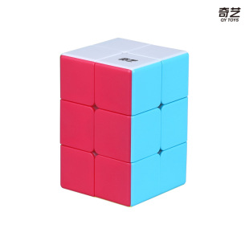
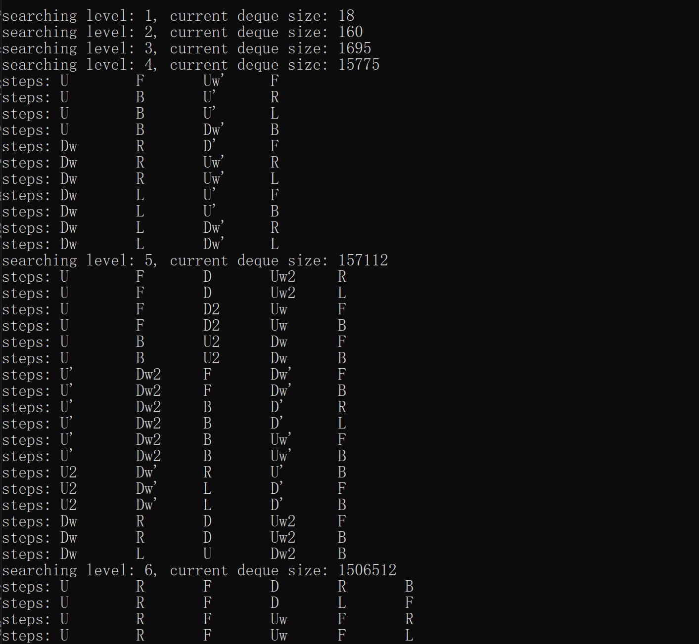

*223 Rubik's Cube*

# 223 Cube Solver

The 223 Cube Solver is a program designed to solve the 223 cube with the minimum number of moves.
By applying search algorithms such as BFS and DFS, the solver finds optimal solutions and provides step-by-step outputs.

In addition to solving cubes, this program can also be used for building your own formula set.

By analysing the generated solutions, cube enthusiasts can extract useful move sequences, study efficient solving techniques, and even develop personalised solving methods.

## Features

 - Using pure C Language: Faster and minimisation of memory usage.

 - BFS Solver: Solves the cube using a queue and explores all possible moves to find the optimal solution.

 - DFS Solver: Solves the cube using recursion, exploring all possible moves but without considering the optimal path.

## To-Do

 - Add API: The project will include an API to allow external programs or scripts to interact with the solver.

 - Add Multi-threaded DFS: Implement a multi-threaded version of DFS to speed up the solving process for large and complex states.

 - GUI version for the 233 cube solver.

## Project Structure

'''
223CubeSolver/
│
├── .vscode/                    # project settings. Generated by VS Code
│
├── 3rd_party/                  # Third Party Library
│   │── cJSON/                  # manage JSON file in C
│
├── src/                        # Source files
│   │── API.c                   # API implementation TODO!
│   ├── bfs_solver.c            # BFS algorithm implementation
│   ├── dfs_solver.c            # DFS algorithm implementation
│   ├── cube_solver.c           # Core solver logic
│   ├── main.c                  # Main entry point
│   ├── move.c                  # Move functions
│   ├── utils.c                 # Utility functions
│
├── include/                    # Header files
│   │── API.c                   # API declarations
│   ├── bfs_solver.h            # BFS algorithm declarations
│   ├── dfs_solver.h            # DFS algorithm declarations
│   ├── cube_solver.h           # Core solver declarations
│   ├── move.h                  # Move declarations
│   ├── utils.c                 # Utility declarations
│
├── images/                     # Project images
│   ├── 223cube.png             # 223 Cube image
│
├── basic_settings.json         # Configuration file for the solver
├── settings.json               # Configuration file for the solver
├── full_settings.json          # Configuration file for the solver
│
├── CMakeLists.txt              # CMake build script
├── LICENSE                     # Project license
└── README.md                   # Project documentation
'''

## Installation

Build with CMake, recommended version > 3.10

## How to use

```bash
223CobeSolver -f /path/to/settings.json
# or
223CobeSolver -file /path/to/settings.json

# args
-h, --help      Show help message
-v, --version   Show version info
-b, --bench     Run benchmark
-f, --file      Specify settings file (default: settings.json)
```

## How to write settings.json

I provided three types of examples.

 - basic_settings.json: only consider basic moves in 223 Cube (R, U, E, and D)

 - settings.json: only consider more moves than basic_settings in 223 Cube (R, U, E, D, and F)

 - full_settings.json: contains all moves in 223 Cube (R, U, E, D, F, L, B, Uw, and Dw)

> [!Important]
> More complex settings with more moves require more time and memory to run. For the BFS algorithm, be especially mindful of memory usage.
> A simpler setting needs less memory and time, but may not be solvable in a limited number of steps.
> Write more settings yourself to create formulas that fit your needs.

All values in the JSON cannot be changed, and none can be missing.

### moves_map (2d array of String) key:

 - Purpose: This key defines how the program iterates over the possible moves.

 - Array Length: The suggested length of each row is 19, but the length of each row can vary as long as it ends with NaN.

 - First Value: The first value in each row indicates the "last move" made.

 - If it's the first move, it will calculate all possible subsequent moves as the "last move" separately.

 - Subsequent Values: After the first move, the next values represent possible moves that follow the previous one.

    For example, in settings.json, if the first move is 'F', the next possible move will be: 'R', 'U', 'U'', 'U2', 'E', 'E'', 'E2', 'D', 'D'', 'D2'.
    It will continue reading through the values until it encounters NaN, then proceed to the next iteration.

 - Iteration: The program continues iterating through possible moves until the state is restored.

### corners (1d array of Integers) key:

 - Purpose: Initial conditions of the scrambled Rubik's Cube (information about the corners)

 - Array Length: must be 8 (represents 8 corners)

 - Coordinate System ()

[!corner_coordinate_system](images/corner_coordinate.png)
*The blue faces forward and the yellow faces upward (top view)*
   
   Yellow-Blue-Orange is in its original position(position 0)
   Yellow-Green-Orange is in its original position(position 1)
   Yellow-Green-Red is in its original position(position 2)
   Yellow-Blue-Red is in its original position(position 3)

   White-Blue-Orange is in its original position(position 4)
   White-Green-Orange is in its original position(position 5)
   White-Red-Green is in its original position(position 6)
   White-Red-Blue is in its original position(position 7)

 - Example: (The blue faces forward and the yellow faces upward)
   
   1. To input the scrambled 223 cube into the solver, you need to record the initial positions of the corners in order.
   2. Look at the cube after it is scrambled. Go through the edges one by one in a fixed order.
   3. Write down the position of each edge piece you see.
   4. Combine these values into an array that represents the cube’s scrambled state.

   Scramble: R U D'

   Look at the corner with the serial number 0 in the coordinate system. It is White-Red-Green, it should be in position 6, so we write down 6. Next, we look at the corner with serial number 1. It is Yellow-Blue-Orange, and it should be in position 0, so we write down 0. The corner with serial number 2 is Yellow-Green-Orange; it should be in position 1, so we write down 1. Continuing, the corner with serial number 3 should be in position 7, the corner with serial number 4 should be in position 2, the corner with serial number 5 should be in position 4, the corner with serial number 6 should be in position 5, and the corner that needs to be in position 7 should be in position 3.

   all in all corners = [6, 0, 1, 7, 2, 4, 5, 3]

 - note: Actually, you don't have to use the blue faces forward and the yellow faces upward view, but this means that the original positions will change. For example, the original position of the Yellow-Blue-Orange corner is 0 in the Blue-Top Yellow-Front case, but in the red faces forward and the white faces upward case, the original position of the Yellow-Blue-Orange corner is 6.


### edges (1d array of Integers) key:

 - Purpose: Initial conditions of the scrambled Rubik's Cube (information about the edge pieces and edge phase)

 - Array Length: must be 6 (represents 4 edges and uses 2 bits to represent the edge phase)

 - Coordinate System (First 4 values for edge positions)

[!corner_coordinate](images/edge_coordinate.png)
*The blue faces forward and the yellow faces upward (top view) (part 1 coordinate; black numbers)*

   Blue-Orange Edge is in its original position(position 0)
   Orange-Green Edge is in its original position(position 1)
   Green-Red Edge is in its original position(position 2)
   Red-Blue Edge is in its original position(position 3)

 - Coordinate System (Last 2 values for edge phase)

[!corner_coordinate](images/edge_coordinate.png)
*The blue faces forward and the yellow faces upward (top view) (part 2 coordinate; red numbers)*

   It is used as a flag to indicate the edge phase. The format is simpler.
   Record the position of one color in Blue, Red, Orange, and Green.

- Example (similar to corners): 

   Scramble: R F

   The edge at position 0 on the coordinate graph is Blue-Red; it should be at position 3, so write down 3. The edge at position 1 on the coordinate graph is Orange-Green; it should be at position 1, so write down 1. Similarly, the edge block at position 2 on the coordinate graph is Blue-Orange; it should be at position 0, and the edge block at position 3 on the coordinate graph should be at position 2.

   edges = [3, 1, 0, 2] (part 1)

   The Blue color appears on positions 1 and 5.

   edges = [1, 5] (part 2)

   Combined the two parts to get the final array

   edges = [3, 1, 0, 2, 1, 5] 


### algorithm (String: "bfs" or "dfs") key:

   - Purpose: Select the algorithm to solve the cube (only support bfs and dfs).

   - bfs: Breadth-First Search (BFS), usually faster, but needs large memory

   - dfs: Depth-First Search (DFS), usually slower, but needs less memory

### max_depth key:

   - Purpose: The maximum depth to search for solutions.

### min_depth key:

   - Purpose: The minimum depth to search for solutions (Only has limitations on the DFS mode, but BFS mode also needs this key).

### Full Example (The blue faces forward and the yellow faces upward):

   Scramble: R Uw R' U' y

   Steps to write settings.json:

   - moves_map: (is already written in the example, or you can write it yourself)

   - corners: Read the position of the corners in order.
   
   The first position is White-Red-Green Corner, it should be on position 6 so array[0] is 6
   (White-Red-Green Corner's original position is 6)
   The second position is Yellow-Blue-Orange Corner, it should be on position 0 so array[1] is 0
   (Yellow-Blue-Orange Corner's original position is 6)
   The third position is Yellow-Blue-Red Corner, it should be on position 2 so array[2] is 2
   (Yellow-Blue-Red Corner's original position is 6)
   The fourth position is Yellow-Blue-Red Corner, it should be on position 3 so array[3] is 3
   (Yellow-Blue-Red Corner's original position is 6)

   The fifth position is Yellow-Green-Orange Corner, it should be on position 1 so array[4] is 1
   (Yellow-Green-Orange Corner's original position is 6)
   The sixth position is White-Blue-Orange Corner, it should be on position 4 so array[5] is 4
   (White-Blue-Orange Corner's original position is 6)
   The seventh position is White-Green-Orange Corner, it should be on position 5 so array[6] is 5
   (White-Green-Orange Corner's original position is 6)
   The eighth position is White-Red-Orange Corner, it should be on position 7 so array[7] is 7
   (White-Red-Orange Corner's original position is 6)

   So in this case, corners = [6, 0, 2, 3, 1, 4, 5, 7]

   - edges: Read the position of the edges in order (first 4 values are similar to corners).
   
   The first position is Orange-Green Edge, it should be on position 1, so array[0] is 1
   (White-Red-Green Corner's original position is 1)
   The second position is Green-Red Edge, it should be on position 2, so array[1] is 2
   (White-Red-Green Corner's original position is 2)
   The third position is Blue-Orange Edge, it should be on position 0, so array[2] is 0
   (White-Red-Green Corner's original position is 2)
   The fourth position is Blue-Red Edge, it should be on position 3, so array[3] is 3
   (White-Red-Green Corner's original position is 2)

   About phase:
   Look at the position of one color in Blue, Red, Orange, and Green.

   The Green appears on position 1 and position 4, so array[4] is 1 and array[5] is 4

   So in this cases edges = [1, 2, 0, 3, 1, 4]

   - min_step set 1 as default

   - max_depth set 6 as default

   - result example with full_settings.json:

   

### Special thanks
 - Epinore (https://github.com/Epinore): He proposed the idea of automated solving, and all the pictures inside were designed by him.

> [!Important]
> 📢 License GPL 3.0, copyleft license.
> I chose this license because I want to see what people will do with it, and I hope this program helps many competitors break world records!
